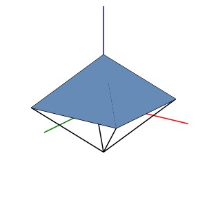

# Third ⅓



Rendering 3d diagrams to svg with depth. Written in Rust and compiled to WebAssembly. Currently being actively worked on.

Todo list:

- [x] Clean up the code a bit, wrap up and abstract away the rendering logic, implement `trait Shape` or something similar.
- [x] Fix precision issues (?).
- [ ] Do 3D tesselation before 2D tesselation.
- [ ] Add support for spheres and circular arcs.
- [ ] Add support for vectors (arrows).
- [ ] (long-term) integrate with Typst and Cetz.


## Building

> requirements: nightly rust, rust wasm toolchain, wasm-pack.

Right now, since there isn't really an API or anything, it's just a demo.

```sh
wasm-pack build --target web
python3 -m http.server # or whatever you prefer
```
